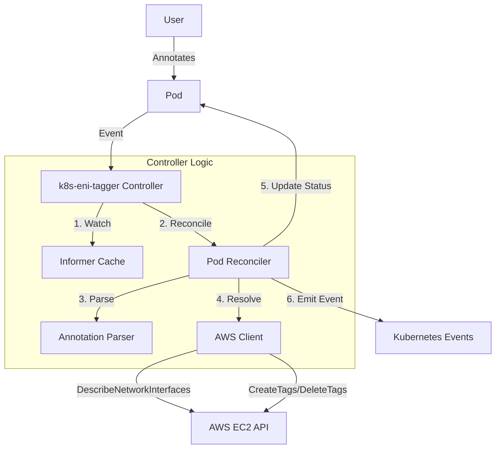

# Architecture

The **k8s-eni-tagger** follows the standard Kubernetes Controller pattern.

## High-Level Overview

## Components

1.  **Manager**: Scaffolds the controller, handles leader election, and manages the lifecycle.
2.  **Pod Reconciler**: The core logic loop.
    - **Watch**: Listens for Pod Create/Update events.
    - **Filter**: Ignores irrelevant Pods (no annotation, hostNetwork).
    - **Sync**: Calculates the difference between desired tags (annotation) and actual tags (state).
3.  **AWS Client**: Wrapper around AWS SDK v2.
    - Handles API calls (`DescribeNetworkInterfaces`, `CreateTags`, `DeleteTags`).
    - Implements retry logic with exponential backoff.
    - Instruments metrics for latency and errors.
4.  **Metrics Server**: Exposes Prometheus metrics (`/metrics`).
5.  **Health Probes**: Exposes Liveness (`/healthz`) and Readiness (`/readyz`) endpoints.

## Data Flow

1.  User creates a Pod with `eni-tagger.io/tags: "Team=Dev"`.
2.  Controller receives an event.
3.  Controller checks if Pod has an IP. If not, it waits.
4.  Controller calls AWS `DescribeNetworkInterfaces` with the Pod IP to find the ENI ID.
5.  Controller compares "Team=Dev" with the last applied tags.
6.  Controller calls AWS `CreateTags` on the ENI.
7.  Controller updates Pod status to `Synced` and emits a `Normal` event.
