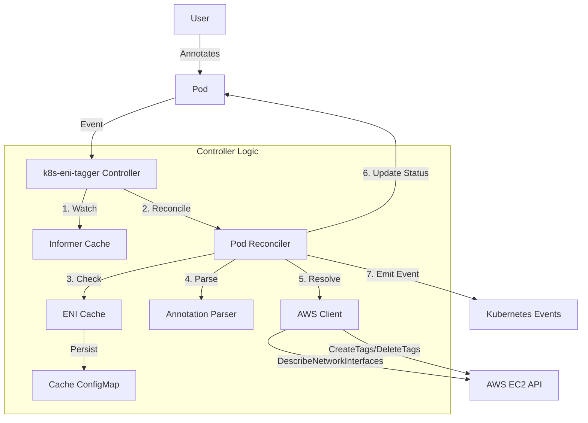

# Architecture

The **k8s-eni-tagger** follows the standard Kubernetes Controller pattern.

## High-Level Overview



## Components

1.  **Manager**: Scaffolds the controller, handles leader election, and manages the lifecycle.
2.  **Pod Reconciler**: The core logic loop.
    - **Watch**: Listens for Pod Create/Update events.
    - **Filter**: Ignores irrelevant Pods (no annotation, hostNetwork).
    - **Sync**: Calculates the difference between desired tags (annotation) and actual tags (state).
3.  **AWS Client**: Wrapper around AWS SDK v2 with **Rate Limiting**.
    - Handles API calls (`DescribeNetworkInterfaces`, `CreateTags`, `DeleteTags`).
    - **Token Bucket Rate Limiter**: Controls QPS to prevent AWS API throttling.
    - Implements retry logic with exponential backoff.
    - Instruments metrics for latency and errors.
4.  **ENI Cache**:
    - Caches ENI IDs resolved from Pod IPs.
    - **Lifecycle-based**: Cache entries are invalidated only when the Pod is deleted (not TTL-based). This ensures consistency and reduces unnecessary AWS API calls.
    - Optional **ConfigMap Persistence**: Preserves cache across controller restarts to reduce API calls on startup.
5.  **Metrics Server**: Exposes Prometheus metrics (`/metrics`).
6.  **Health Probes**: Exposes Liveness (`/healthz`) and Readiness (`/readyz`) endpoints.

## Security & IAM Permissions

The controller requires the following AWS IAM permissions to function:

```json
{
  "Version": "2012-10-17",
  "Statement": [
    {
      "Sid": "ENITaggingPermissions",
      "Effect": "Allow",
      "Action": [
        "ec2:DescribeNetworkInterfaces",
        "ec2:CreateTags",
        "ec2:DeleteTags"
      ],
      "Resource": "*"
    },
    {
      "Sid": "HealthCheckPermissions",
      "Effect": "Allow",
      "Action": [
        "ec2:DescribeAccountAttributes"
      ],
      "Resource": "*"
    }
  ]
}
```

**Note**: The controller uses the default AWS credential chain (IRSA, instance profile, etc.). Ensure the service account or node has the appropriate IAM role attached. See `iam-policy.json` for the complete policy template.

### Network Security

The controller supports two levels of network security:

#### 1. Kubernetes NetworkPolicy

When enabled, restricts controller pod network traffic to:
- **Ingress**: Metrics (8090), health probes (8081)
- **Egress**: DNS (53), Kubernetes API (443/6443), AWS APIs (443)

Requires a network policy provider (Calico, Cilium, etc.) in the cluster.

#### 2. AWS Security Groups for Pods (EKS only)

Attaches AWS security groups directly to controller pods using the `SecurityGroupPolicy` CRD. This provides native AWS firewall rules at the pod level.

**Prerequisites:**
- EKS VPC CNI with `ENABLE_POD_ENI=true`
- `AmazonEKSVPCResourceController` IAM policy on cluster role
- Nitro-based EC2 instances (for trunk ENI support)

**Automatic Pod Restarts:**
The deployment includes a checksum annotation for security group IDs. When security groups change, the checksum changes, triggering a rolling update of controller pods.

### Tag Namespace Prefixing

For enterprise multi-tenant scenarios, the controller supports tag namespace prefixing via the `--tag-namespace` flag. This prevents tag conflicts in shared AWS Organizations:

**Example:**
```yaml
# Annotation: eni-tagger.io/tags: "CostCenter=1234,Team=Platform"
# With --tag-namespace="acme-corp"
# Results in: acme-corp:CostCenter=1234, acme-corp:Team=Platform
```

**Use cases:**
- Mergers and acquisitions (M&A) scenarios
- Managed service providers (MSPs) with multiple tenants
- Multi-organization AWS accounts
- Clear ownership boundaries for cost allocation

## Data Flow

1.  User creates a Pod with `eni-tagger.io/tags: "CostCenter=1234,Team=Platform"`
2.  Controller receives an event.
3.  Controller checks if Pod has an IP. If not, it waits.
4.  Controller checks the ENI cache first. If not cached, it calls AWS `DescribeNetworkInterfaces` with the Pod IP to find the ENI ID.
5.  Controller compares desired tags with the last applied tags.
6.  Controller calls AWS `CreateTags` on the ENI.
7.  Controller updates Pod status to `Synced` and emits a `Normal` event.
8.  On Pod deletion, the controller removes the cache entry and cleans up finalizers.
