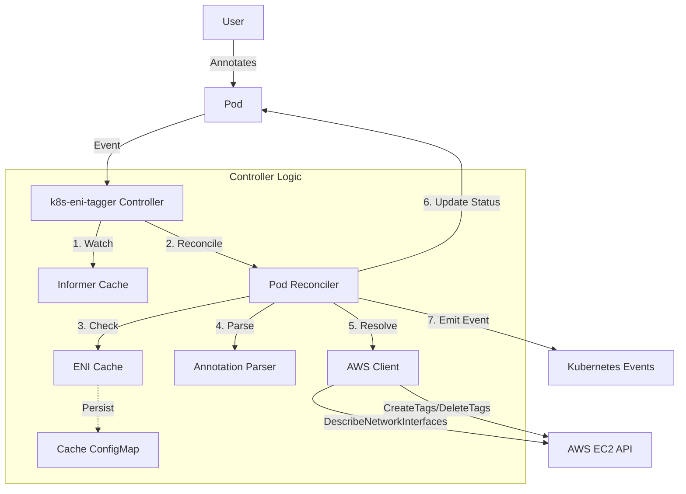

# k8s-eni-tagger

> Kubernetes controller for automatic AWS ENI tagging based on Pod annotations

---

## Overview

**k8s-eni-tagger** is a production-grade Kubernetes controller that automatically tags AWS Elastic Network Interfaces (ENIs) associated with Pods, using Pod annotations. This enables cost allocation, security automation, and resource tracking directly from Kubernetes to AWS.

- **Automatic ENI Tagging**: Propagate Pod metadata to AWS ENIs for cost, security, and automation.
- **High Availability**: Leader election, multi-replica support.
- **Metrics & Health**: Prometheus metrics, readiness/liveness probes.
- **Security**: IRSA support, custom service accounts, least-privilege IAM.
- **Flexible Configuration**: Helm chart, manifest, and Docker support.

---

## Quick Start

### Prerequisites
- Kubernetes 1.19+
- Helm 3.0+
- AWS EKS or EC2-based cluster
- IAM permissions for EC2 ENI operations

### Install with Helm (Recommended)

```bash
helm install k8s-eni-tagger oci://ghcr.io/prabhu-mannu/charts/k8s-eni-tagger \
  --version 0.1.1 \
  --namespace kube-system --create-namespace
```

Or apply manifests:

```bash
kubectl apply -f https://github.com/prabhu-mannu/k8s-eni-tagger/releases/download/v0.1.1/manifests.yaml
```

---

## Usage Example

Annotate your Pod with ENI tags using either format:

**Simple comma-separated format** (recommended for basic use):
```yaml
apiVersion: v1
kind: Pod
metadata:
  name: my-app
  annotations:
    eni-tagger.io/tags: "CostCenter=1234,Team=Platform,Environment=Production"
spec:
  containers:
    - name: nginx
      image: nginx
```

**JSON format** (for complex values with special characters):
```yaml
apiVersion: v1
kind: Pod
metadata:
  name: my-app
  annotations:
    eni-tagger.io/tags: '{"CostCenter":"1234","Team":"Platform","Description":"App with = sign"}'
spec:
  containers:
    - name: nginx
      image: nginx
```

The controller will apply these tags to the Pod's ENI in AWS.

---

## Configuration Highlights

| Flag                          | Default              | Description                                                                  |
| ----------------------------- | -------------------- | ---------------------------------------------------------------------------- |
| `--annotation-key`            | `eni-tagger.io/tags` | Annotation key to watch for tags.                                            |
| `--watch-namespace`           | `""` (all)           | Namespace to watch. If empty, watches all.                                   |
| `--max-concurrent-reconciles` | `1`                  | Number of concurrent worker threads.                                         |
| `--dry-run`                   | `false`              | Enable dry-run mode (no AWS changes).                                        |
| `--metrics-bind-address`      | `:8090`              | Address to bind Prometheus metrics.                                          |
| `--health-probe-bind-address` | `:8081`              | Address to bind health probes.                                               |
| `--subnet-ids`                | `""`                 | Comma-separated list of allowed Subnet IDs.                                  |
| `--allow-shared-eni-tagging`  | `false`              | Allow tagging of shared ENIs.                                                |
| `--enable-eni-cache`          | `true`               | Enable in-memory ENI caching.                                                |
| `--enable-cache-configmap`    | `false`              | Enable ConfigMap persistence for ENI cache.                                  |
| `--aws-rate-limit-qps`        | `10`                 | AWS API rate limit (requests per second).                                    |
| `--aws-rate-limit-burst`      | `20`                 | AWS API rate limit burst.                                                    |
| `--pprof-bind-address`        | `0` (disabled)       | Address to bind pprof endpoint.                                              |

---

## Architecture



- **Pod Reconciler**: Watches Pod events, parses annotations, resolves ENIs, and syncs tags.
- **AWS Client**: Handles EC2 API calls with rate limiting and retries.
- **ENI Cache**: In-memory and optional ConfigMap persistence for ENI lookups.
- **Metrics & Health**: Prometheus `/metrics` and health probes `/healthz`, `/readyz`.

---

## Health Checks & Metrics

- **Readiness Probe**: Verifies AWS API connectivity.
- **Prometheus Metrics**: Latency, operation counts, active workers, cache stats.
- **Rate Limiting**: Prevents AWS API throttling with configurable QPS and burst.

---

## FAQ & Troubleshooting

> [!NOTE]
> **Q:** Why aren't my ENIs being tagged?
> **A:** Ensure your Pod has the correct annotation, the controller has IAM permissions, and the ENI is not shared (unless enabled).

> [!TIP]
> **Q:** How do I monitor controller health?
> **A:** Use `/metrics` for Prometheus and `/readyz` for readiness.

> [!IMPORTANT]
> **Q:** What IAM permissions are required?
> **A:** `ec2:DescribeNetworkInterfaces`, `ec2:CreateTags`, `ec2:DeleteTags` on all ENIs.

---

## Resources
- [Helm Chart Documentation](charts/k8s-eni-tagger/README.md)
- [Architecture Details](ARCHITECTURE.md)
- [Changelog](CHANGELOG.md)
- [Contributing Guide](CONTRIBUTING.md)

---

> For advanced configuration, see the Helm chart `values.yaml` and controller flags.

---
