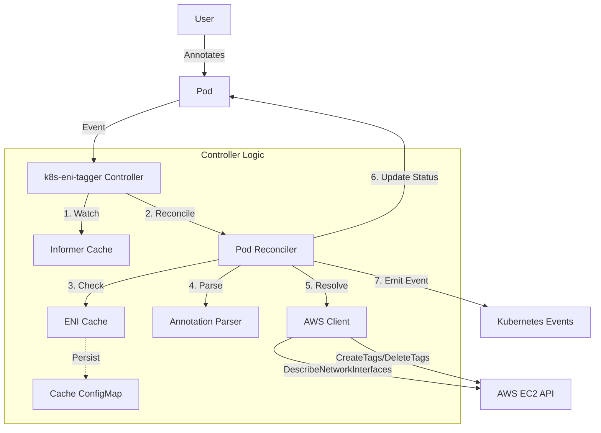

# k8s-eni-tagger

> Kubernetes controller for automatic AWS ENI tagging based on Pod annotations

---

## Overview

**k8s-eni-tagger** is a production-grade Kubernetes controller that automatically tags AWS Elastic Network Interfaces (ENIs) associated with Pods, using Pod annotations. This enables cost allocation, security automation, and resource tracking directly from Kubernetes to AWS.

- **Automatic ENI Tagging**: Propagate Pod metadata to AWS ENIs for cost, security, and automation.
- **High Availability**: Leader election, multi-replica support.
- **Metrics & Health**: Prometheus metrics, readiness/liveness probes.
- **Security**: IRSA support, custom service accounts, least-privilege IAM.
- **Flexible Configuration**: Helm chart, manifest, and Docker support.

---

## Quick Start

### Prerequisites
- Kubernetes 1.19+
- Helm 3.0+
- AWS EKS or EC2-based cluster
- IAM permissions for EC2 ENI operations

### Install with Helm (Recommended)

```bash
helm install k8s-eni-tagger oci://ghcr.io/prabhu-mannu/charts/k8s-eni-tagger \
  --version 0.1.1 \
  --namespace kube-system --create-namespace
```

Or apply manifests:

```bash
kubectl apply -f https://github.com/prabhu-mannu/k8s-eni-tagger/releases/download/v0.1.1/manifests.yaml
```

---

## Usage Example

Annotate your Pod with ENI tags using either format:

**Simple comma-separated format** (recommended for basic use):
```yaml
apiVersion: v1
kind: Pod
metadata:
  name: my-app
  annotations:
    eni-tagger.io/tags: "CostCenter=1234,Team=Platform,Environment=Production"
spec:
  containers:
    - name: nginx
      image: nginx
```

**JSON format** (for complex values with special characters):
```yaml
apiVersion: v1
kind: Pod
metadata:
  name: my-app
  annotations:
    eni-tagger.io/tags: '{"CostCenter":"1234","Team":"Platform","Description":"App with = sign"}'
spec:
  containers:
    - name: nginx
      image: nginx
```

The controller will apply these tags to the Pod's ENI in AWS.

---

## Configuration Highlights

| Flag                          | Default              | Description                                                                  |
| ----------------------------- | -------------------- | ---------------------------------------------------------------------------- |
| `--annotation-key`            | `eni-tagger.io/tags` | Annotation key to watch for tags.                                            |
| `--watch-namespace`           | `""` (all)           | Namespace to watch. If empty, watches all.                                   |
| `--max-concurrent-reconciles` | `1`                  | Number of concurrent worker threads.                                         |
| `--dry-run`                   | `false`              | Enable dry-run mode (no AWS changes).                                        |
| `--metrics-bind-address`      | `8090`               | Port or address for Prometheus metrics. Bare ports are auto-prefixed with `:`. |
| `--health-probe-bind-address` | `8081`               | Port or address for health probes. Bare ports are auto-prefixed with `:`.    |
| `--subnet-ids`                | `""`                 | Comma-separated list of allowed Subnet IDs.                                  |
| `--allow-shared-eni-tagging`  | `false`              | Allow tagging of shared ENIs.                                                |
| `--enable-eni-cache`          | `true`               | Enable in-memory ENI caching.                                                |
| `--enable-cache-configmap`    | `false`              | Enable ConfigMap persistence for ENI cache.                                  |
| `--aws-rate-limit-qps`        | `10`                 | AWS API rate limit (requests per second).                                    |
| `--aws-rate-limit-burst`      | `20`                 | AWS API rate limit burst.                                                    |
| `--pprof-bind-address`        | `0` (disabled)       | Address to bind pprof endpoint.                                              |
| `--tag-namespace`             | `""` (disabled)      | Control automatic pod namespace-based tag namespacing. Set to 'enable' to use the pod's Kubernetes namespace as tag prefix. Any other value disables namespacing. |
| `--pod-rate-limit-qps`        | `0.1`                | Per-pod reconciliation rate limit (requests per second).                     |
| `--pod-rate-limit-burst`      | `1`                  | Burst size for per-pod rate limiter.                                         |
| `--rate-limiter-cleanup-interval` | `1m`             | Interval for pruning stale per-pod rate limiters.                            |

---

### Environment variable fallbacks

Most CLI flags can be set via environment variables using the `ENI_TAGGER_` prefix. For example:

- `--dry-run` -> `ENI_TAGGER_DRY_RUN=true`
- `--metrics-bind-address` -> `ENI_TAGGER_METRICS_BIND_ADDRESS="8090"`
- `--aws-rate-limit-qps` -> `ENI_TAGGER_AWS_RATE_LIMIT_QPS=20`

Rules:
- CLI flags take precedence over environment variables.
- If the CLI flag is not supplied and an env var is present, the env value is used.
- Subnet IDs can also be set via `ENI_TAGGER_SUBNET_IDS` (comma-separated list).


## Enabling Namespace Tagging on Existing Deployments

⚠️ **Important**: When enabling `--tag-namespace=enable` on a running deployment, existing ENIs will be automatically updated to use namespaced tags.

### Transition Behavior

**Before enabling namespacing:**
```yaml
# Pod annotation
eni-tagger.io/tags: '{"CostCenter":"123","Team":"Dev"}'

# ENI tags applied
CostCenter=123, Team=Dev
```

**After enabling namespacing** (`--tag-namespace=enable`):
```yaml
# Same pod annotation
eni-tagger.io/tags: '{"CostCenter":"123","Team":"Dev"}'

# ENI tags updated to
default:CostCenter=123, default:Team=Dev
```

### Side Effects & Considerations

- **Automatic Migration**: All existing ENIs are updated during normal reconciliation
- **Temporary Duplication**: ENIs may temporarily have both old and new tag formats
- **AWS API Usage**: Each ENI requires additional API calls for the transition
- **Rate Limiting**: Large clusters may hit AWS API limits - monitor and adjust `--aws-rate-limit-qps`
- **Gradual Rollout**: Updates occur during pod lifecycle events (may take time for full migration)

### Best Practices for Migration

1. **Monitor AWS API Usage**: Watch CloudWatch metrics for throttling
2. **Schedule During Low Traffic**: Enable during maintenance windows
3. **Increase Rate Limits if Needed**:
   ```bash
   --aws-rate-limit-qps=20 --aws-rate-limit-burst=50
   ```
4. **Verify Tag Cleanup**: Ensure old non-namespaced tags are removed

---

## AWS Tagging Best Practices

### Tag Naming Conventions

Follow AWS best practices for consistent, maintainable tagging:

#### **Use PascalCase** (AWS Standard)
```yaml
# ✅ Recommended - matches AWS console and documentation
eni-tagger.io/tags: "CostCenter=1234,Team=Platform,Environment=Production"

# ❌ Avoid mixing conventions
eni-tagger.io/tags: "cost_center=1234,TEAM=Platform,environment=Production"
```

**Why PascalCase?**
- Standard in AWS Console and CloudFormation
- Consistent with AWS-generated tags (`Name`, `Owner`, `Environment`)
- Easier to read and maintain across teams

#### **Tag Constraints (AWS Limits)**

| Constraint | Limit | Notes |
|------------|-------|-------|
| **Max tags per ENI** | 50 | Controller enforces this limit |
| **Key max length** | 127 characters | UTF-8 Unicode supported |
| **Value max length** | 255 characters | Can be empty |
| **Allowed characters** | `a-z, A-Z, 0-9, spaces, + - = . _ : / @` | Cross-service compatible |
| **Reserved prefixes** | `aws:`, `kubernetes.io/cluster/` | Cannot be used in tag keys |
| **Case sensitivity** | Yes | `CostCenter` ≠ `costcenter` |

#### **Security Guidelines**

> [!CAUTION]
> **Tags are not encrypted!** Do not store sensitive data:
> - ❌ Passwords, API keys, secrets
> - ❌ Social Security Numbers, credit card numbers
> - ❌ Personal identifiable information (PII)
> - ✅ Cost center codes, team names, environment labels

#### **Enterprise Multi-Tenant Scenarios**

Use `--tag-namespace=enable` to automatically namespace tags with the pod's Kubernetes namespace, preventing conflicts in shared environments:

```yaml
# Without namespacing (default)
eni-tagger.io/tags: "CostCenter=1234,Team=Platform"
# Results in: CostCenter=1234, Team=Platform

# With namespacing enabled (--tag-namespace=enable)
eni-tagger.io/tags: "CostCenter=1234,Team=Platform"
# Results in: production:CostCenter=1234, production:Team=Platform
```

**Benefits:**
- Automatic namespacing using Kubernetes namespaces
- Prevents conflicts in multi-tenant environments
- Clear ownership boundaries without manual configuration
- Easier cost reporting per organization/department
- Supports managed service providers (MSPs)

#### **Recommended Tag Categories**

```yaml
# Technical Tags (for automation)
eni-tagger.io/tags: "Environment=Production,Version=v1.2.3,Cluster=eks-prod-us-west-2"

# Business Tags (for cost allocation)
eni-tagger.io/tags: "CostCenter=1234,Project=Migration2024,BusinessUnit=Engineering"

# Security Tags (for compliance)
eni-tagger.io/tags: "Compliance=SOC2,DataClassification=Internal,Owner=platform-team@example.com"
```

For complete AWS tagging guidelines, see [AWS_TAGGING_BEST_PRACTICES.md](docs/AWS_TAGGING_BEST_PRACTICES.md).

---

## Architecture



- **Pod Reconciler**: Watches Pod events, parses annotations, resolves ENIs, and syncs tags.
- **AWS Client**: Handles EC2 API calls with rate limiting and retries.
- **ENI Cache**: In-memory and optional ConfigMap persistence for ENI lookups.
- **Metrics & Health**: Prometheus `/metrics` and health probes `/healthz`, `/readyz`.

---

## Security Features

### Network Policy

The controller supports Kubernetes `NetworkPolicy` for pod-level network isolation. This restricts network traffic to only what's necessary for the controller to function.

**Enable NetworkPolicy via Helm:**

```yaml
networkPolicy:
  enabled: true
```

The NetworkPolicy allows:
- **Ingress**: Prometheus metrics (8090), health probes (8081)
- **Egress**: DNS (53), Kubernetes API (443/6443), AWS APIs (443)

**Requirements:**
- Network policy provider (Calico, Cilium, Weave, etc.) must be installed in your cluster

### Security Groups for Pods

For EKS clusters, the controller supports attaching AWS security groups directly to controller pods using the `SecurityGroupPolicy` CRD.

**Enable SecurityGroupPolicy via Helm:**

```yaml
securityGroupPolicy:
  enabled: true
  groupIds:
    - sg-0123456789abcdef0  # Controller security group
    - sg-abcdef0123456789   # Additional security group (optional)
```

**Prerequisites:**
1. EKS cluster with VPC CNI configured for security groups for Pods:
   ```bash
   kubectl set env daemonset aws-node -n kube-system ENABLE_POD_ENI=true
   kubectl set env daemonset aws-node -n kube-system POD_SECURITY_GROUP_ENFORCING_MODE=standard
   ```
2. Cluster IAM role has `AmazonEKSVPCResourceController` policy attached
3. Nitro-based EC2 instance types (required for trunk ENIs)

**Security Group Requirements:**
- Allow **inbound** from node security group for kubelet probes (port 8081)
- Allow **outbound TCP/UDP port 53** to CoreDNS security group
- Allow **outbound HTTPS (443)** to AWS APIs and Kubernetes API server
- Allow **inbound** for Prometheus scraping if metrics collection is enabled (port 8090)

**Pod Restart on Security Group Changes:**
The deployment includes a checksum annotation that automatically triggers pod restarts when security group IDs change:
```yaml
checksum/security-groups: {{ .Values.securityGroupPolicy.groupIds | toJson | sha256sum }}
```

**Important:** The annotation `vpc.amazonaws.com/pod-eni` is NOT used for security group binding. Use the `SecurityGroupPolicy` CRD instead.

For more details, see [AWS Security Groups for Pods](https://docs.aws.amazon.com/eks/latest/userguide/security-groups-for-pods.html).

---

## Health Checks & Metrics

- **Readiness Probe**: Verifies AWS API connectivity.
- **Prometheus Metrics**: Latency, operation counts, active workers, cache stats.
- **Rate Limiting**: Prevents AWS API throttling with configurable QPS and burst.

---

## FAQ & Troubleshooting

> [!NOTE]
> **Q:** Why aren't my ENIs being tagged?
> **A:** Ensure your Pod has the correct annotation, the controller has IAM permissions, and the ENI is not shared (unless enabled).

> [!TIP]
> **Q:** How do I monitor controller health?
> **A:** Use `/metrics` for Prometheus and `/readyz` for readiness.

> [!IMPORTANT]
> **Q:** What IAM permissions are required?
> **A:** `ec2:DescribeNetworkInterfaces`, `ec2:CreateTags`, `ec2:DeleteTags`, and `ec2:DescribeAccountAttributes` (for health checks). See `iam-policy.json` for the complete policy.

---

## IAM Policy

The controller requires specific IAM permissions to manage ENI tags. A complete IAM policy is provided in `iam-policy.json`:

```json
{
  "Version": "2012-10-17",
  "Statement": [
    {
      "Sid": "ENITaggingPermissions",
      "Effect": "Allow",
      "Action": [
        "ec2:DescribeNetworkInterfaces",
        "ec2:CreateTags",
        "ec2:DeleteTags"
      ],
      "Resource": "*"
    },
    {
      "Sid": "HealthCheckPermissions",
      "Effect": "Allow",
      "Action": [
        "ec2:DescribeAccountAttributes"
      ],
      "Resource": "*"
    }
  ]
}
```

**Setup with IRSA (Recommended):**

```bash
# Create IAM policy
aws iam create-policy \
  --policy-name k8s-eni-tagger-policy \
  --policy-document file://iam-policy.json

# Create IAM role with IRSA
eksctl create iamserviceaccount \
  --name k8s-eni-tagger \
  --namespace kube-system \
  --cluster my-cluster \
  --attach-policy-arn arn:aws:iam::123456789012:policy/k8s-eni-tagger-policy \
  --approve
```

---

## Resources
- [IAM Policy Template](iam-policy.json)
- [Helm Chart Documentation](charts/k8s-eni-tagger/README.md)
- [Architecture Details](ARCHITECTURE.md)
- [AWS Tagging Best Practices](docs/AWS_TAGGING_BEST_PRACTICES.md)
- [Annotation Format Research](docs/ANNOTATION_FORMAT_RESEARCH.md)
- [Changelog](CHANGELOG.md)
- [Contributing Guide](CONTRIBUTING.md)
- [Pre-commit Setup Guide](docs/PRE_COMMIT_SETUP.md)

---

> For advanced configuration, see the Helm chart `values.yaml` and controller flags.

---
